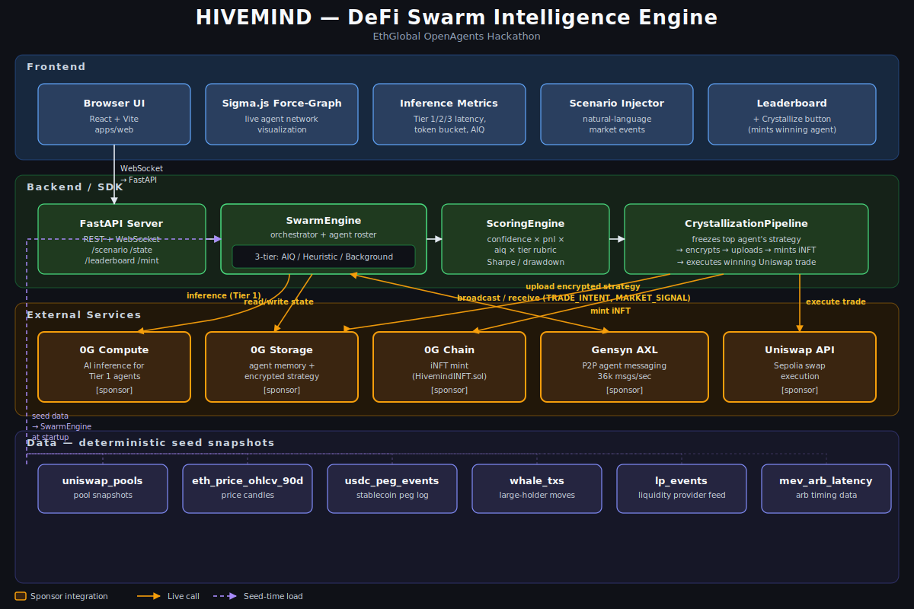

# HIVEMIND



DeFi Swarm Intelligence Engine for the ETHGlobal OpenAgents hackathon.

HIVEMIND simulates a DeFi swarm, crystallizes the winning strategy into an iNFT-backed agent, and executes a real Uniswap trade.

## Target Integrations

- 0G: Compute, Storage, Chain, iNFTs, and `hivemind-sdk`.
- Gensyn AXL: cross-process agent communication.
- Uniswap: Sepolia quote and swap execution through the Uniswap API.

## Status

Phase 2 local AXL proof is live:

- `packages/hivemind-sdk`: deterministic swarm engine, provider adapter boundaries, seed replay, tier metrics, scenario injection, and transcript output.
- `apps/api`: FastAPI REST and WebSocket API as the canonical scenario/state surface.
- `apps/axl-node`: local AXL-compatible coordinator/evaluator processes over TCP JSONL with transcript evidence.
- `apps/web`: React/Vite dashboard backed by the API/WebSocket stream with mock fallback.
- `contracts`: Hardhat scaffold with a minimal `HivemindINFT` contract shape for 0G iNFT proof work.
- `data`: deterministic seed snapshots for local simulation.
- `docs`: architecture and integration notes for 0G, Gensyn AXL, and Uniswap.

## AXL Benchmark Results

Local Gensyn AXL coordinator benchmarks across 2- and 5-node clusters, sending 1,000 trade-intent and 1,000 market-signal messages per run (4,000 total deliveries, 2,000 sends per cluster). Source: [`apps/axl-node/benchmark_results.json`](apps/axl-node/benchmark_results.json).

| Nodes | Messages Sent | Messages Received | Throughput (msgs/sec) | p50 Latency (ms) | p95 Latency (ms) | Duration (s) | Avg RSS (KB) |
|------:|--------------:|------------------:|----------------------:|-----------------:|-----------------:|-------------:|-------------:|
| 2     | 2,000         | 2,000             | 36,057                | 29.30            | 53.47            | 0.056        | 25,024       |
| 5     | 2,000         | 2,000             | 38,547                | 28.52            | 51.34            | 0.052        | 25,712       |

**What this means in plain English:** the swarm can move ~36,000–38,500 messages per second between AXL nodes, with the typical message arriving in under 30 milliseconds. That is fast enough for agents to coordinate trades in real time without the network being a bottleneck — and the throughput actually goes up slightly when the cluster grows from 2 to 5 nodes, which means the AXL routing scales cleanly as you add nodes instead of slowing down.

## hivemind-sdk — OpenClaw-Inspired Architecture

hivemind-sdk's architecture is directly inspired by OpenClaw's agent framework. AgentArchetype mirrors OpenClaw's pluggable Skills system — subclass to define a new DeFi actor persona, register it with SwarmEngine, and it participates in the swarm immediately. SwarmEngine mirrors OpenClaw's Gateway — a single control plane orchestrating all agent instances, their memory state, 0G Compute inference scheduling, and Gensyn AXL communication pools. ScenarioInjector mirrors OpenClaw's session/messaging layer — the interface through which external events enter the system and propagate to all active instances. hivemind-sdk is OpenClaw's architectural DNA, applied to a DeFi-native multi-agent simulation context, deployed on 0G Compute and Storage infrastructure.

| OpenClaw Concept | hivemind-sdk Parallel |
|---|---|
| Skills system — drop a SKILL.md in, agent gains that capability | AgentArchetype — subclass to define a DeFi actor persona, register with SwarmEngine |
| Gateway — single control plane for all agents, sessions, channels | SwarmEngine — orchestrates all agent instances, inference scheduling, AXL routing |
| Session model — persistent context per user/channel | Per-agent KV Store (live state) + Log Store (history) |
| Extensions — modular add-ons to core gateway behavior | ScenarioInjector + ScoringEngine — modular components extending SwarmEngine |

## Quickstart

Five commands take you from a fresh clone to a running PanicSeller swarm:

```bash
git clone https://github.com/<your-org>/HIVEMIND.git
cd HIVEMIND
pip install -e packages/hivemind-sdk
cp .env.example .env
HIVEMIND_USE_MOCK_INFERENCE=true python examples/panic_seller.py
```

`examples/panic_seller.py`:

```python
from hivemind_sdk import AgentArchetype, SwarmEngine, ScenarioInjector


class PanicSeller(AgentArchetype):
    archetype_name = "panic_seller"

    def decide(self, market_state, memory) -> dict:
        if market_state["price_delta_pct"] < -0.05:
            return {"action": "SELL", "amount": memory["portfolio"] * 0.5}
        return {"action": "HOLD"}

    def heuristic(self, market_state, memory) -> dict:
        if market_state["price_delta_pct"] < -0.10:
            return {"action": "SELL", "amount": memory["portfolio"] * 0.3}
        return {"action": "HOLD"}


engine = SwarmEngine(archetypes=[PanicSeller], count=100)
injector = ScenarioInjector(engine)
engine.run()
injector.inject("20% ETH price drop over 4 hours")
```

## SDK Public API

The SDK is the import surface external builders depend on. Everything below is exported from `hivemind_sdk`.

### AgentArchetype

Base class for every agent persona in the swarm.

- **Subclass** to define a DeFi actor (e.g., `PanicSeller`, `Whale`, `Degen`).
- **Required:** override at least one of `decide`, `heuristic`, or `mock_decide`. Each takes `(market_state: dict, memory: dict)` and returns `{"action": str, "confidence": float, "rationale": str, ...}`.
- **Optional class attribute:** `archetype_name` — sets the agent's name; falls back to the lowercased class name.
- **Optional constructor params:** `tier` (1/2/3), `risk_appetite`, `momentum_bias`, `liquidity_bias`, `hedge_bias`, `aiq_base` — all in `[0.0, 1.0]`.
- **Optional method:** `on_signal(message)` — invoked when an AXL message is delivered to this agent.

### SwarmEngine

Main orchestrator — holds the agent roster, evaluates them against scenarios, and emits ranked snapshots.

Key constructor params:

- `archetypes`: list of `AgentArchetype` subclasses **or** instances.
- `count` / `agent_count`: number of agents to spawn (default 24).
- `seed`: deterministic seed for jitter.
- `axl_node_urls`: optional list of `tcp://host:port` strings to enable real P2P messaging via `AXLPoolManager`.
- `axl_transcript_path`: optional path that switches the engine into local-AXL transcript mode.
- `inference_provider`, `storage_provider`, `message_bus`, `execution_provider`: pluggable adapters for 0G Compute, 0G Storage, Gensyn AXL, and Uniswap.

Key methods:

- `engine.run(ticks=1)` — synchronous wrapper; runs N ticks and returns the final `SwarmSnapshot`.
- `engine.run_async(ticks=1)` — same, awaitable.
- `engine.tick(scenario=None)` — async; advances one tier-1/2/3 tick.
- `engine.inject_scenario(scenario)` — synchronous; evaluates every agent against a single `Scenario`.
- `engine.aclose()` — release the AXL pool, if connected.

### ScenarioInjector

Natural-language adapter for `engine.inject_scenario`.

```python
injector = ScenarioInjector(engine)
injector.inject("20% ETH price drop over 4 hours")
injector.inject("12% SOL rally over 30 minutes")
```

The parser extracts asset (any uppercase ticker), direction (drop / rally / flat), magnitude (any `N%` token), and duration (`seconds|minutes|hours|days|weeks`). It builds a `Scenario` and forwards to the engine. `injector.parse(prompt)` returns the `Scenario` without injecting.

### ScoringEngine

Pluggable scoring surface — wraps the same `confidence × pnl × aiq × tier` rubric the engine uses internally so external callers can rank arbitrary agent states the same way the leaderboard does. Drop in a custom subclass to change the formula without touching the engine.

### AXLPoolManager

Multi-node P2P pool client for Gensyn AXL.

```python
from hivemind_sdk import AXLPoolManager

pool = AXLPoolManager(
    node_urls=["tcp://localhost:7001", "tcp://localhost:7002"],
    pool_id="hivemind-main",
    agent_id="agent-001",
)
await pool.connect()
await pool.broadcast("TRADE_INTENT", {"action": "buy", "size_usd": 250_000})
await pool.send("agent-002", "MARKET_SIGNAL", {"signal_strength": 0.8})
inbox = await pool.receive(timeout=1.0)
await pool.disconnect()
```

Connects to every node in parallel, falls back gracefully on dead nodes, dedupes incoming messages by id, and exposes `message_count` for observability. `SwarmEngine(axl_node_urls=[...])` consumes it transparently.

## Local Development

Use `npm.cmd` on Windows PowerShell if `npm.ps1` is blocked by execution policy.

### SDK and API Tests

```powershell
$env:PYTHONPATH='packages/hivemind-sdk/src;apps/api/src;apps/axl-node/src'
C:\Python313\python.exe -m pytest packages/hivemind-sdk/tests apps/api/tests apps/axl-node/tests -q
```

### Local AXL Smoke

```powershell
$env:PYTHONPATH='packages/hivemind-sdk/src;apps/axl-node/src'
C:\Python313\python.exe -m hivemind_axl_node smoke --messages 20 --transcript runs/axl/smoke.jsonl
```

To make the API/dashboard read that transcript as the active AXL source:

```powershell
$env:PYTHONPATH='packages/hivemind-sdk/src;apps/api/src'
$env:HIVEMIND_USE_MOCK_GENSYN='false'
$env:GENSYN_AXL_TRANSCRIPT_PATH='runs/axl/smoke.jsonl'
C:\Python313\python.exe -m uvicorn hivemind_api.app:app --host localhost --port 8000
```

### API Server

```powershell
$env:PYTHONPATH='packages/hivemind-sdk/src;apps/api/src'
C:\Python313\python.exe -m uvicorn hivemind_api.app:app --reload --host localhost --port 8000
```

The API loads deterministic seed snapshots from `data/snapshots` and writes local run transcripts under ignored `runs/YYYYMMDD-HHMMSS/` directories.

### Web Dashboard

```powershell
cd apps/web
& "$env:ProgramFiles\nodejs\npm.cmd" install
$env:VITE_HIVEMIND_API_URL='http://localhost:8000'
& "$env:ProgramFiles\nodejs\npm.cmd" run dev
```

If `VITE_HIVEMIND_API_URL` is missing or the API is offline, the dashboard falls back to its deterministic mock stream and labels that state visibly.

### Local Scenario Smoke

```powershell
$env:PYTHONPATH='packages/hivemind-sdk/src;apps/api/src'
C:\Python313\python.exe -m uvicorn hivemind_api.app:app --host localhost --port 8000
```

In a second PowerShell:

```powershell
Invoke-RestMethod http://localhost:8000/health
Invoke-RestMethod http://localhost:8000/scenario -Method Post -ContentType 'application/json' -Body '{"scenario_id":"readme-smoke","label":"README smoke","volatility":0.6,"liquidity_delta":-0.2,"sentiment":0.1,"gas_pressure":0.3,"signal_strength":0.7}'
```

### Contracts

```powershell
cd contracts
& "$env:ProgramFiles\nodejs\npm.cmd" install
& "$env:ProgramFiles\nodejs\npm.cmd" run compile
& "$env:ProgramFiles\nodejs\npm.cmd" test
```

## Current Boundaries

Phase 2 proves local cross-process AXL-style messaging and keeps live Gensyn/RL Swarm as a gated attempt. It does not yet claim live 0G Compute/Storage, iNFT testnet minting, or Uniswap API execution. ENS, KeeperHub, breeding, marketplace, LP management, live GraphRAG, and mainnet execution remain off the critical path.
